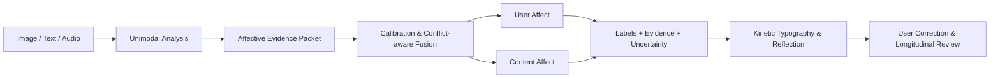
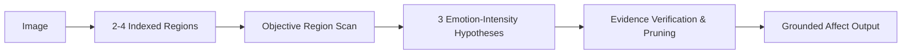

# AICA-Bench × EmoType × EmoBridge 结题答辩 PPT 逐页框架

> 推荐主讲 18 页，控制在 15-18 分钟；Demo 另计 2 分钟。
> 每页只保留一个中心结论，所有实验数字标注来源。
>
> 当前工作区没有单独的“EmoType 论文”PDF，因此相关理论页使用现有 EmoType /
> EmoMirror 技术方案、项目代码和 Wav2Vec2 情绪模型关联论文。若另有指定论文，
> 制作最终 PPT 时应补充其原始图表和准确引用。

## 0. 全局叙事

整场答辩使用一条因果链：

```text
现有情感 AI 的问题
→ AICA 发现视觉模型强度误判和描述浅表化
→ EmoType 提供语音/文本 V-A 与动态字体基础
→ EmoBridge 提出证据化三模态融合和用户修正闭环
→ 实验验证模型、融合、表达与系统性能
→ 产品 Demo 展示实际价值
```

推荐章节：

1. 问题与研究基础。
2. 总体方法与算法。
3. 数据集与实验。
4. 产品与技术实现。
5. Demo、创新与总结。

## Slide 1：标题页

**标题**

EmoBridge：证据驱动的多模态情绪理解与动态表达系统

**副标题**

From Affective Benchmarking to Interactive Emotion Journaling

**画面**

- 中央放一条由图片、语音波形、文字流向动态字体的主视觉。
- 下方放团队、指导教师和日期。

**讲述**

一句话说明：项目把 AICA 的视觉情感研究与 EmoType 的语音/文本动态排版结合，
形成可解释、可修正、可长期复盘的情绪日记系统。

## Slide 2：背景与真实问题

**中心结论**

现有情绪系统往往只给标签，缺少原因、强度、表达和用户确认。

**内容**

- 情绪识别不是只有“正面/负面”。
- 述情障碍用户可能难以识别、命名和表达情绪。
- 图像模型容易依赖人脸，文本模型容易依赖显性词，语音模型缺少语义。
- 写完后才反馈，难以形成实时的“情感镜子”。

**画面**

左侧“现有系统”：输入 → 单标签。

右侧“目标系统”：多模态输入 → 证据 → 动态表达 → 用户修正。

## Slide 3：研究问题与目标

**中心结论**

项目研究“理解、融合、表达、应用”四个层次。

**内容**

- RQ1：如何识别效价、强度和隐性情绪？
- RQ2：如何处理三模态不一致？
- RQ3：如何把证据映射成动态字体？
- RQ4：是否能促进情绪觉察与反思？

**画面**

四个相连圆环：Understand、Fuse、Express、Reflect。

## Slide 4：整体 Pipeline 总览图

**中心结论**

这是整场答辩最重要的一页，后续所有页面都应回到该图。



**制作要求**

- 用三种颜色表示三个模态。
- 统一证据包和融合层使用项目主色。
- 用虚线回环表示用户修正用于个性化校准。
- 页面右下角标出“实时路径”和“复盘路径”。

**讲述**

控制在 60-90 秒，先讲输入与单模态，再讲统一证据、双状态、渲染和闭环。

## Slide 5：三项工作的融合逻辑

**中心结论**

AICA 是视觉理论与评测，EmoType 是情绪到字体的技术基础，EmoBridge 是系统落地。

**画面**

三层阶梯：

1. AICA-Bench：EU / ER / EGCG / GAT。
2. EmoType：Text / Audio / V-A-D / Typography。
3. EmoBridge：Fusion / Product / Feedback / Longitudinal Data。

**内容**

用 3×3 表格说明每项工作的输入、输出和最终贡献。

## Slide 6：AICA-Bench 的任务设计

**中心结论**

视觉情感能力应同时评价理解、原因推理和情绪一致生成。

**内容**

- EU：Expressed Emotion + Evoked Emotion。
- ER：视觉证据为什么支持该情绪。
- EGCG：根据目标情绪生成图像事实一致的描述。

**模型原理图**

```text
Image → EU Label → ER Evidence → EGCG Affective Content
```

**案例**

用同一张图片展示三种问题和三种输出，避免只放定义。

## Slide 7：AICA 数据集构建

**中心结论**

AICA 用跨数据集、跨视觉风格和结构化指令构建完整评测。

**内容**

- 9 个公开数据集。
- 8,086 张图片。
- 20 名标注者人工检查。
- 18,124 条 EU/ER/EGCG 指令。
- 覆盖现实、社交媒体、艺术和抽象图像。

**总览图**

```text
9 Datasets
→ Auto Selection
→ Manual Inspection
→ 8,086 Images
→ GPT-4o Instruction Generation
→ 18,124 Instructions
```

**右侧图表**

用 donut/bar 展示：

- 7 个数据集各 1,000。
- ArtPhoto 806。
- Abstract 280。

## Slide 8：AICA 评分模型

**中心结论**

开放式情绪推理不能只靠 BLEU，需要评价对齐、描述性和因果合理性。

**内容**

- 10,000 个 ER/EGCG 问答对。
- 每条 5 人评分，标注池 10 人。
- Krippendorff's alpha = 0.78。
- Qwen2.5-VL-7B + LoRA，8:1:1，3 epochs。
- ER Pearson 0.880，EGCG Pearson 0.900。

**画面**

显示 Scoring Model 的训练流程和三个评分维度。

## Slide 9：AICA 实验发现与模型选择

**中心结论**

模型规模不是情感能力的充分条件，项目选择应依据任务表现。

**主图**

展示 Overall 排名：

- Gemini-2.5-Pro：73.49。
- Qwen-VL-Max：72.90。
- GPT-4o：72.82。
- Qwen2.5-VL-7B：65.78。
- Qwen2.5-VL-3B：61.81。

**右侧结论**

- 闭源模型作为上界。
- Qwen2.5-VL-7B 作为开源研究主模型。
- 3B 作为轻量对照。
- 不以参数量直接替代评测。

## Slide 10：GAT 算法原理

**中心结论**

GAT 通过“区域观察—候选分支—证据验证”校准强度并增加描述深度。

**模型原理图**



**关键参数**

- 宽度 `k=3`。
- 深度 `d=3`。
- 每个候选引用 Region ID。
- 验证阶段检查支持证据和反证。

**实验结论**

- EU +6.15 pp。
- ER +3.54 pp。
- EGCG +3.96 pp。

## Slide 11：EmoType 音频与文本模型

**中心结论**

文本负责语义与效价，语音负责声学状态与唤醒。

**左侧：音频**

```text
16 kHz Audio
→ Wav2Vec2 Encoder
→ 12-layer Transformer
→ Mean Pooling
→ Regression Head
→ A/D/V
```

- 模型在 MSP-Podcast 上微调。
- 原始输出约 `[0,1]`，项目归一化到 `[-1,1]`。
- 关联论文报告 MSP-Podcast Valence CCC 0.638。
- 论文指出语言内容更适合 valence，副语言声学信息更适合 arousal/dominance，
  支持文本与语音的分工式融合。

**右侧：文本**

```text
Segments
→ Explicit Classifier
  + Implicit Rules
  + Optional Regression/LLM
→ Segment V-A + Evidence
```

- 展示“没事，但胸口很紧”的隐性情绪案例。

## Slide 12：统一情绪空间与冲突感知融合

**中心结论**

系统不是简单平均，而是依据置信度、可靠性和维度优势进行融合。

**公式**

```text
weight(m,d) = confidence × reliability × prior
fused(d) = Σ weight × value / Σ weight
```

**双状态**

- User Affect。
- Content Affect。

**冲突案例**

```text
文本：平静
语音：高唤醒
图像：消极场景
→ 输出“arousal 冲突”，请求用户确认
```

**画面**

三条模态曲线汇入两个状态卡片，不画成单一漏斗。

## Slide 13：情绪到动态字体

**中心结论**

视觉反馈由连续情绪变量和证据共同决定，而不是仅替换颜色。

**映射图**

- Valence → 色相/冷暖。
- Arousal → 速度/抖动/缩放/字重。
- Dominance → 字距/秩序/压缩扩张。
- Confidence → 饱和度/透明度。
- Conflict → 双层/错位/节奏差。
- Evidence → 强调字符。

**案例**

同一句复杂情绪文本展示：

- 固定字体。
- 仅标签驱动。
- segment-level 证据驱动。

## Slide 14：产品设计目标与功能

**中心结论**

EmoBridge 是“情感镜子”，不是自动诊断工具。

**六个目标**

可见、可解释、可修正、可积累、可控、不诊断。

**功能地图**

- Journal。
- Body。
- Diary。
- Review。
- Records。
- Image Affect（新增）。

**用户流程**

```text
表达 → 看见 → 理解 → 确认/修正 → 保存 → 周期复盘
```

## Slide 15：前后端与模型部署

**中心结论**

轻量实时服务与重型视觉推理解耦，保证稳定性和可扩展性。

**架构图**

```text
Browser
→ FastAPI
  → Text Emotion
  → Wav2Vec2
  → Fusion / VA Mapper
  → Typography
  → SQLAlchemy DB
  → Image Adapter → GPU VLM / Vision API
```

**技术栈**

- 前端：HTML/CSS/JS。
- 后端：FastAPI。
- 数据库：SQLite/PostgreSQL。
- 模型：Wav2Vec2、文本分类/规则、Qwen2.5-VL/Gemini。
- 部署：Docker、Render、独立 GPU/VLM 服务。
- 可靠性：timeout、cache、fallback、health check。

## Slide 16：项目实验与测试

**中心结论**

实验从模型、融合、表达和系统四层验证。

**推荐四象限表**

| 层级 | 对比 | 指标 |
| --- | --- | --- |
| 图像 | Basic / CoT / VS / AT / GAT | F1、强度错误、ER/EGCG |
| 文本音频 | 单模型 / 规则融合 / 校准 | F1、MAE/CCC、时延 |
| 多模态 | 单模态 / 平均 / 加权 / 冲突 | F1、V-A、修正距离 |
| 产品 | 固定 / 标签 / V-A / 证据字体 | 一致性、信任、反思 |

**必须区分**

- 蓝色：论文报告。
- 绿色：项目实测。
- 灰色：待完成。

## Slide 17：产品 Demo

**建议现场控制在 90-120 秒**

1. 输入含隐性情绪的文字。
2. 展示 segment V-A、证据和动态字体。
3. 上传图片，展示区域图和 GAT 候选验证。
4. 播放语音，展示音频 VAD。
5. 展示融合与冲突解释。
6. 用户修改标签/V-A 并保存。
7. 打开 Review 展示周期性趋势。

**页面布局**

- 左侧操作录屏。
- 右侧同步显示 Pipeline 节点点亮。
- 页面底部展示关键 API 输出摘要。

**备用**

- 无网络 fallback。
- 缓存案例。
- 预录视频。

## Slide 18：创新点

**采用四象限或四列布局**

### 集成创新

AICA 视觉情感 + EmoType 文本/语音 V-A + EmoBridge 产品闭环。

### 应用创新

把模型标签转为实时情绪镜像、日记复盘和用户修正。

### 改进创新

GAT 强度校准、隐性文本规则、可靠性融合、冲突检测和 fallback。

### 原创创新

User/Content Affect 双状态、统一证据包、证据到字符映射、冲突可视化闭环。

**讲述注意**

原创创新说“本项目提出并验证的系统机制”，不要无证据地说“世界首创算法”。

## Slide 19：总结、局限与未来工作

**总结**

- 从评测到模型。
- 从模型到多模态融合。
- 从融合到动态表达。
- 从表达到用户闭环。

**局限**

- 情绪具有主观性和文化差异。
- AICA 主要为静态图像和英文提示。
- 文本 V-A 回归头和融合权重仍需标注数据校准。
- VLM 成本与隐私需要进一步优化。
- 当前系统不能用于医疗诊断。

**未来**

- 个性化校准。
- 视频与时序情绪。
- 跨文化评测。
- 轻量模型与端侧隐私。

## Slide 20：结束页

**一句话**

EmoBridge 不只是识别情绪，而是帮助用户看见、理解并重新表达情绪。

放二维码或 Demo 地址，以及 `Q&A`。

## 附录建议

### Appendix A：API 契约

- `/analyze-text`
- `/predict`
- `/analyze-image`
- `/analyze-multimodal`

### Appendix B：GAT Prompt

- Region Observation。
- Candidate Branching。
- Grounded Verification。

### Appendix C：数据集详情

9 个 AICA 数据集的标签体系、样本数和许可。

### Appendix D：实验完整表格

主 PPT 只保留关键结果，完整结果放附录。

### Appendix E：隐私与伦理

- 知情同意。
- 数据隔离。
- 删除机制。
- 非诊断声明。
- 高风险内容提示策略。

### Appendix F：团队分工

按模型、融合、前端、后端、设计和实验说明每位成员的实际贡献。

## 视觉规范建议

- AICA 图像分支：蓝紫色。
- Text：青色。
- Audio：橙色。
- Fusion：深蓝。
- Product/Feedback：绿色。
- 论文数据右上角标注 `Reported in AICA-Bench`。
- 项目数据标注 `Measured in EmoBridge`。
- 不在一页放超过 2 张复杂图。
- 每张结果图上方写一句结论，而不是只放图表标题。

## 时间分配

| 部分 | 建议时间 |
| --- | ---: |
| 背景、问题、Pipeline | 3 分钟 |
| AICA、模型和融合算法 | 6 分钟 |
| 数据与实验 | 3 分钟 |
| 产品与部署 | 2 分钟 |
| Demo | 2 分钟 |
| 创新、局限、总结 | 2 分钟 |
