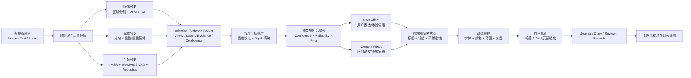
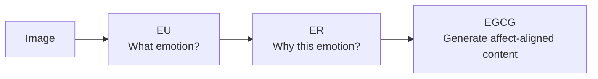
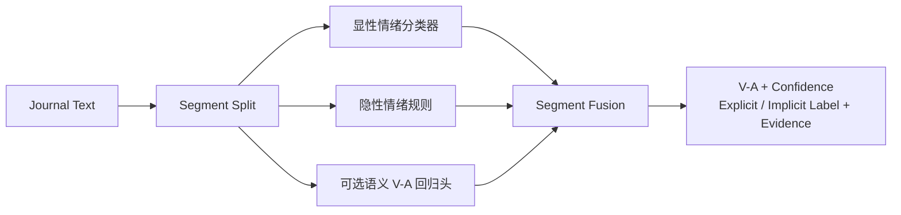
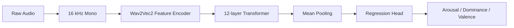
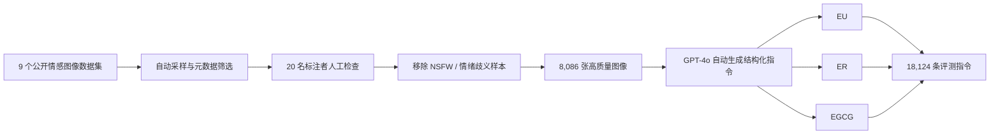
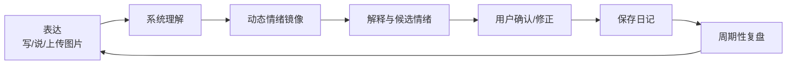
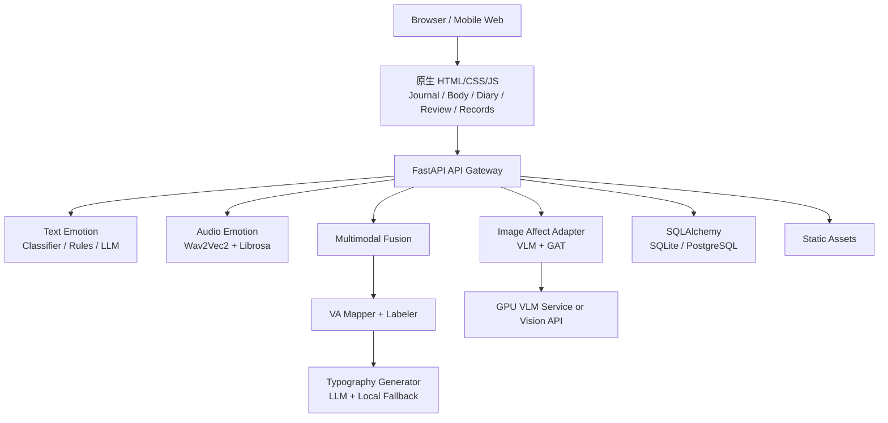

# AICA-Bench × EmoType × EmoBridge 融合、实施与结题答辩指导方案

> 本方案综合以下材料修订：
>
> - AICA-Bench 接受提交版论文；
> - `Idea/EmoMirror_情绪计算与渲染技术方案.md`；
> - `Idea/EmoMirror.md`；
> - 当前 `EmoBridge_update` 代码与 README；
> - 本地 Wav2Vec2 情绪模型的模型卡及其关联论文。
>
> 本文是项目总体技术方案。逐页 PPT 制作稿见
> `AICA_EMOBRIDGE_DEFENSE_PPT_OUTLINE.md`。
>
> **证据说明：**当前工作区未提供单独的“EmoType 论文”PDF。本文中的 EmoType
> 理论部分来自现有技术方案、项目实现，以及本地 Wav2Vec2 模型对应的 dimensional
> speech emotion recognition 论文。若后续补充另一篇 EmoType 论文，应再将其
> 数据集、模型和实验结果逐项替换或并入本文，不能混用来源。

## 1. 项目定位

建议结题项目统一命名为：

**EmoBridge：一个证据驱动、强度校准、可交互修正的图像-文本-语音多模态情绪理解与动态表达系统。**

一句话主线：

> AICA-Bench 解决“如何评价并改进视觉模型的情绪理解、推理与生成”，
> EmoType 解决“如何将语音与文本情绪转化为动态字体”，EmoBridge 则把二者
> 融合为面向情绪日记的多模态理解、视觉反馈、用户修正与长期复盘系统。

项目不是三个模型的简单拼接，而是一条完整研究链路：

```text
视觉情感能力评测与诊断
→ 单模态情绪建模
→ 多模态证据对齐
→ 情绪强度校准与冲突处理
→ 字符级动态视觉表达
→ 用户修正与长期情绪复盘
```

## 2. 三项基础工作的关系

| 工作 | 核心问题 | 在融合项目中的角色 |
| --- | --- | --- |
| AICA-Bench | VLM 是否真正具备情绪理解、推理和生成能力 | 图像分支的理论基础、模型选择依据、GAT 方法和评测框架 |
| EmoType | 如何从语音/文本情绪生成动态排版反馈 | 音频 VAD、V-A 映射、字符级动态字体的技术基础 |
| EmoBridge / EmoMirror | 如何服务真实用户的情绪觉察、记录和复盘 | 产品场景、多模态融合、交互修正、数据库和部署 |

### 2.1 AICA-Bench 提供什么

- EU：Emotion Understanding，识别图像表达或诱发的情绪。
- ER：Emotion Reasoning，用视觉事实解释情绪形成原因。
- EGCG：Emotion-Guided Content Generation，生成情绪一致且不脱离图像事实的内容。
- AICA Scoring：评价 Emotion Alignment、Descriptiveness 和 Causal Soundness。
- GAT Prompting：用视觉脚手架和层次化验证减少强度误判和空泛描述。

### 2.2 EmoType 提供什么

- 基于 Wav2Vec2 的语音 Arousal、Dominance、Valence 回归。
- 基于文本显性/隐性线索的 segment-level V-A 分析。
- V-A 到标签、颜色、象限和候选情绪的映射。
- V-A-D、置信度与声学特征到字体、颜色、缩放和动画的映射。
- 字符索引形式的 `llm_design`，便于前端逐字符渲染。

### 2.3 EmoBridge 新增什么

- 图像、文本、音频统一证据结构。
- User Affect 与 Content Affect 双状态。
- 置信度、可靠性和模态先验共同参与的后融合。
- 模态冲突检测和可解释反馈。
- 视觉/语义/声学证据驱动的字符级动态排版。
- Journal、Body、Diary、Review、Records 组成的长期情绪闭环。

## 3. 学术贡献表述边界

答辩必须按照真实署名和真实分工陈述贡献。

如果 AICA-Bench 是你参与署名的工作，可以说：

- “前期研究中，我们构建了 AICA-Bench，并提出 GAT Prompting。”
- “在本项目中，我进一步负责/参与了 GAT 的应用化、多模态融合和 EmoBridge 系统实现。”

如果 AICA-Bench 不是你的署名成果，应说：

- “本项目以 AICA-Bench 的诊断结论、评测框架和 GAT 方法为理论基础，
  完成复现、扩展和应用验证。”

无论哪种情况，都不要把 AICA-Bench 描述成一个可直接调用的“AICA 模型”。
它包含 benchmark、评分模型和 prompting 框架。

## 4. 研究问题与核心假设

### RQ1：情绪理解

如何让系统从图像、文本和语音中识别情绪效价、强度和语义，而不是只依赖
人脸、关键词、音量或语言先验？

### RQ2：多模态融合

当图像、文本和语音给出不一致判断时，如何避免简单平均，并输出模态贡献、
一致性、冲突和不确定性？

### RQ3：动态表达

如何把模型输出及其证据映射为动态字体、颜色和动画，使视觉反馈既能表达情绪，
又不会替用户武断地下结论？

### RQ4：产品与用户价值

实时动态情感排版能否帮助亚临床述情障碍用户提高情绪颗粒度、自我表露深度和
反思意愿？

### 核心假设

1. 区域级视觉证据和 AffectToT 验证可以减少图像情绪强度误判。
2. 文本负责语义效价、语音负责唤醒强度、图像负责人物与环境语境的分工式融合，
   优于单模态或简单平均。
3. 证据驱动动态排版比固定排版或仅标签驱动排版更容易被用户理解和接受。
4. 用户修正可以同时提升系统可信度，并形成后续个性化校准数据。

## 5. 整体 Pipeline



### 5.1 两条产品工作流

**实时情绪镜像**

```text
键盘/语音输入
→ 文本与语音快速分析
→ V-A 融合
→ 200-500 ms 级基础动态反馈
→ 用户调整反馈强度或标签
```

实时路径要轻量、稳定，并保留本地 fallback。图像 VLM 不应阻塞逐字反馈。

**日记复盘**

```text
日记文本 + 图片 + 语音片段 + 身体感受
→ 完整多模态推理
→ GAT 图像证据
→ 情绪冲突与原因分析
→ 动态排版成品 + 反思问题 + 周期性报告
```

复盘路径允许更高延迟，可以调用 VLM/LLM，但必须有超时、缓存和本地降级。

## 6. 模型架构与算法原理

### 6.1 图像情绪：AICA 与 GAT

#### AICA 三层能力



- EU 负责识别 expressed emotion 与 evoked emotion。
- ER 负责从人物、动作、物体、背景、光照、色彩和构图中寻找原因。
- EGCG 负责生成情绪一致、细节充分且不虚构视觉事实的描述。

#### GAT 三阶段


1. **Region Observation**：逐区域描述客观事实，不提前判断情绪。
2. **Candidate Branching**：提出 3 个“情绪 + Low/Medium/High 强度”候选，
   每个候选必须引用区域 ID。
3. **Grounded Verification**：检查区域事实是否支持该候选，并寻找反证。

论文设置 AffectToT 搜索宽度 `k=3`、深度 `d=3`。它不是无限制 Tree of Thoughts，
而是一次受约束的“提出候选—证据核验—剪枝”过程。

#### 为什么适合 EmoBridge

- 防止只看人脸而忽略场景、姿态和关系。
- 将图像情绪强度转换为可校准的 arousal。
- 区域 ID 可以成为产品中的可解释证据。
- 视觉证据可进一步驱动文字局部颜色、节奏和空间布局。

### 6.2 文本情绪：显性分类 + 隐性规则 + V-A



当前 `text_emotion.py` 已实现：

- 显性情绪分类：`Johnson8187/Chinese-Emotion-Small`。
- 隐性线索：否认、弱化、转折、身体紧绷、压力过载、羞耻、自责、
  压抑愤怒、孤独、关系评价和行为冲动。
- 可选回归路线：
  `paraphrase-multilingual-MiniLM-L12-v2 + MLP regression head`。
- 模型不可用时使用确定性规则。
- 当前代码还支持 DeepSeek 语义分析后回退到本地路径。

原技术方案的核心原则应保留：

```text
语义模型负责理解，
V-A mapper 负责连续情绪空间，
标签层负责解释，
渲染层负责表达。
```

文本分支输出 segment-level 结果，不能把整段矛盾情绪过早平均：

```json
{
  "text": "我说没事，但胸口一直很紧",
  "valence": -0.45,
  "arousal": 0.65,
  "confidence": 0.78,
  "explicit_label": "中性",
  "implicit_label": "焦虑",
  "evidence": ["否认式表达", "转折后加权", "身体紧绷"]
}
```

### 6.3 语音情绪：Wav2Vec2 Dimensional SER



本地模型源自 dimensional speech emotion recognition：

- 基础模型为 Wav2Vec2-Large-Robust。
- 从 24 个 Transformer 层裁剪为 12 层后在 MSP-Podcast v1.7 上微调。
- 回归头结构为 `Dropout → Dense → Tanh → Dropout → Linear(3)`。
- 输出顺序为 Arousal、Dominance、Valence，原始范围约为 `[0, 1]`。
- 项目通过 `normalize_vad` 转换到 `[-1, 1]`。

项目同时使用 `librosa` 提取 pitch 和 energy。后续应增加 duration、静音比例、
信噪比或可懂度估计，作为音频可靠性，而不是直接作为情绪标签。

#### ASR 与 SER 的分工

```text
Whisper / Browser ASR → 语义内容 → Text Emotion
Wav2Vec2 SER          → 声学情绪 → Audio VAD
```

ASR 不负责情绪分类，SER 不负责复杂语义理解。

### 6.4 V-A-D 与标签映射

`va_mapper.py` 负责：

- V-A 归一化。
- 四象限与中性区域。
- 80 标签词典中的最近标签与候选标签。
- 距离、标签置信度、颜色和整体 segment 汇总。

现有整体 V-A 使用文本长度和 segment 置信度加权：

```text
segment_weight = max(1, text_length) × max(0.05, confidence)
```

后续标签层不应只使用最近 V-A 点，建议：

```text
label_score =
  0.45 × semantic_probability
+ 0.35 × VA_prototype_similarity
+ 0.15 × appraisal_feature_match
+ 0.05 × context_consistency
```

### 6.5 统一证据结构

三个分支先转换成统一结构，再进行融合：

```json
{
  "modality": "image|text|audio",
  "target": "user_expressed|content_evoked|context",
  "unit_id": "region-2|segment-3|audio-0.0-2.4",
  "valence": -0.42,
  "arousal": 0.67,
  "dominance": 0.18,
  "label_distribution": [
    {"label": "焦虑", "score": 0.72},
    {"label": "紧张", "score": 0.64}
  ],
  "confidence": 0.78,
  "reliability": 0.84,
  "evidence": ["Region 2: 双手紧握", "语音能量升高"],
  "source": "gat|text_model|wav2vec2"
}
```

### 6.6 User Affect 与 Content Affect

这是融合系统的关键设计。

- **User Affect**：用户当前表达或体验到的情绪。主要依据文本、语音和图像中
  人物的 expressed emotion。
- **Content Affect**：图像或事件可能诱发的情绪。主要依据 image evoked emotion、
  场景语境和日记事件。

“用户平静地描述一张悲伤图片”不等于“用户当前非常悲伤”。Content Affect
可以影响背景主题和复盘语境，但不能在低置信度时强行覆盖 User Affect。

### 6.7 冲突感知后融合

初期采用可解释后融合，不直接训练端到端三模态模型。

对维度 `d ∈ {V, A, D}`：

```text
weight(m, d) =
  confidence(m) × reliability(m) × modality_prior(m, d)

fused(d) =
  Σ weight(m, d) × value(m, d)
  ───────────────────────────
         Σ weight(m, d)
```

建议先验：

- 文本对 valence、语义标签更可靠。
- 语音对 arousal 更可靠。
- 图像对环境语境、人物动作和 evoked emotion 更可靠。
- GAT 验证分数进入图像置信度。
- 音频质量、ASR 置信度和文本长度进入可靠性。

当模态距离超过阈值时，不隐藏差异：

```json
{
  "agreement": 0.43,
  "conflict": true,
  "conflict_dimensions": ["arousal"],
  "explanation": "文本表达平静，但语音能量与声学模型显示较高唤醒。",
  "needs_user_confirmation": true
}
```

### 6.8 情绪到动态字体

最终渲染不只依赖标签：

| 情绪变量 | 字体/视觉参数 |
| --- | --- |
| Valence | 色相、明暗、冷暖 |
| Arousal | 动画速度、抖动、缩放、字重 |
| Dominance | 字距、排列秩序、压缩/扩张 |
| Confidence | 饱和度、透明度、边缘清晰度 |
| Complexity | 渐变、多色、分层阴影 |
| Conflict | 双层、错位、局部节奏差异 |
| Evidence | 选择需要强调的关键词和字符 |

四象限基础规则：

| 象限 | 代表情绪 | 建议视觉 |
| --- | --- | --- |
| 消极高唤醒 | 愤怒、焦虑、紧张 | 红/紫、高字重、收紧、急促抖动 |
| 积极高唤醒 | 兴奋、惊喜、期待 | 黄/橙、放大、弹跳、明亮高饱和 |
| 消极低唤醒 | 悲伤、孤独、疲惫 | 蓝/灰、下坠、低透明、增大留白 |
| 积极低唤醒 | 平静、安心、放松 | 绿/青、缓慢呼吸、稳定漂浮 |

复杂情绪应采用 segment-level 局部渲染，不应平均成“中性”。

## 7. AICA-Bench 数据集构建

### 7.1 数据构建总流程



### 7.2 图像来源

| 数据集 | 数量 | 主要用途/特点 |
| --- | ---: | --- |
| EmoSet | 1,000 | 多层情感属性，适合 evoked emotion |
| Emotion6 | 1,000 | 六类基本情绪加中性 |
| FI | 1,000 | 社交媒体自然图像 |
| FlickrLDL | 1,000 | 情绪标签分布 |
| TwitterLDL | 1,000 | 社交媒体情绪分布 |
| FindingEmo | 1,000 | 野外场景 expressed emotion |
| EMOTIC | 1,000 | 人物与上下文情绪 |
| ArtPhoto | 806 | 艺术摄影 |
| Abstract | 280 | 抽象视觉情感 |
| **合计** | **8,086** | 覆盖现实、艺术、人物、场景与抽象图像 |

### 7.3 指令构建

- EU 包含 Expressed Emotion Recognition 和 Evoked Emotion Prediction。
- EU 同时使用 Basic Prompt 与 CoT Prompt。
- ER 输入图像与情绪标签，要求解释视觉证据为何支持该情绪。
- EGCG 输入图像与目标情绪，要求生成情绪一致的场景描述。
- 所有任务累计 18,124 条标准化指令。

### 7.4 开放式评分模型

AICA 另外构建 10,000 个开放式问答对：

- ER 5,000 条。
- EGCG 5,000 条。
- 训练/验证/测试划分为 8:1:1。
- 每条回答由 10 人标注池中随机选择的 5 人独立打分。
- 采用 1-5 Likert 评分。
- 标注者一致性 Krippendorff's alpha 为 0.78。
- 基于 Qwen2.5-VL-7B，使用 LoRA 训练 3 个 epoch。

评分维度：

- ER：Emotion Alignment、Descriptiveness、Causal Soundness。
- EGCG：Emotion Alignment、Descriptiveness。

## 8. 实验结果与理论指导

所有答辩数据必须标明来源，分成“论文报告”“项目实测”“计划实验”。

### 8.1 AICA 论文已报告结果

#### 模型选择结果

| 模型 | EU Avg. | ER Avg. | EGCG Avg. | Overall |
| --- | ---: | ---: | ---: | ---: |
| Gemini-2.5-Pro | 67.27 | 79.08 | 74.13 | 73.49 |
| Qwen-VL-Max | 65.02 | 77.75 | 75.93 | 72.90 |
| GPT-4o | 64.93 | 77.81 | 75.73 | 72.82 |
| Qwen2.5-VL-7B | 56.84 | 74.50 | 66.00 | 65.78 |
| Qwen2.5-VL-3B | 54.13 | 69.68 | 61.63 | 61.81 |

理论指导：

- 闭源模型可作为性能上界。
- Qwen2.5-VL-7B 是论文中表现最好的开源模型，适合研究主模型。
- 3B 模型可作为资源受限对照。
- 参数规模不是情感能力的单调决定因素，模型选择应基于任务表现而不是只看参数量。

#### 诊断结果

- 72.25% 的 EU 错误属于强度错误。
- 27.75% 属于极性错误。
- 遮挡人脸后 F1 下降 11.1%。
- 开放式任务 Emotion Alignment 较高，但 Descriptiveness 明显较低。

理论指导：

- EmoBridge 必须显式建模 arousal 和强度。
- 图像分支必须检查人物之外的动作、环境、光照和构图。
- 复盘文案和动态排版要引用具体证据，避免模板化反馈。

#### GAT 改进

| 任务 | 论文报告的平均提升 |
| --- | ---: |
| EU | +6.15 percentage points |
| ER | +3.54 percentage points |
| EGCG | +3.96 percentage points |

人类评估中：

- GPT-4o 的 ER Overall 从 3.45 提升到 3.90，EGCG 从 3.71 提升到 4.02。
- Qwen2.5-VL-7B 的 ER Overall 从 3.28 提升到 3.72，EGCG 从 3.53 提升到 3.86。

#### 评分模型

AICA 评分模型与人类判断的 Pearson 相关系数：

- ER：0.880。
- EGCG：0.900。

它可作为开放式结果的辅助评分器，但仍应配合人工抽样检查。

### 8.2 EmoType 音频模型的论文依据

Wav2Vec2 dimensional SER 关联论文报告：

- Valence CCC 为 0.638。
- 在 IEMOCAP 和 MOSI 等跨语料测试中优于此前 wav2vec 2.0 结果。
- 论文分析指出，语言内容通常更有利于 valence，副语言声学信息通常更有利于
  arousal 和 dominance，这为 EmoBridge 的文本-语音分工式融合提供了依据。

这些数据只能作为所采用基础模型的理论依据，不能写成 EmoBridge 自己的实验结果。
项目仍需在自己的录音、语言和设备条件下重新评测。

### 8.3 EmoBridge 当前可展示的工程证据

当前仓库已经具备：

- 文本 `/analyze-text` 完整返回 V-A、显性/隐性标签、证据和 `llm_design`。
- 音频 `/predict` 返回原始与归一化 VAD、声学特征和设计图。
- 80 标签 V-A 词典和四象限颜色映射。
- 用户 V-A 拖拽、标签修正和反馈强度控制。
- Journal、Body、Diary、Review、Records 页面。
- SQLite/PostgreSQL、JSON/CSV 导出、Docker/Render 配置。
- `audio/` 中 18 个可用于演示和初步检查的情绪音频样本。

这些属于功能与工程完成度，不等价于模型准确率。

### 8.4 答辩前必须补出的项目实验

#### 图像 GAT 消融

数据：AICA 中选取 200-500 张代表性图像。

比较：

1. Basic Prompt。
2. CoT。
3. Visual Scaffolding only。
4. AffectToT only。
5. Full GAT。

指标：

- Weighted F1。
- 强度错误率。
- 极性错误率。
- ER/EGCG 三项评分。
- P50/P95 时延和单次成本。

#### 文本情绪实验

数据：

- 200-500 条中文日记句段。
- 覆盖显性、否认、弱化、转折、身体线索、关系线索和复杂情绪。

比较：

1. 词典规则。
2. 中文分类器。
3. 分类器 + 隐性规则。
4. LLM。
5. 未来 V-A 回归头。

指标：

- 标签 Macro/Weighted F1。
- V-A MAE、Pearson 或 CCC。
- 隐性情绪子集准确率。
- 平均时延和失败率。

#### 音频实验

数据：

- 现有 18 个样本用于初步检查。
- 正式结果应补充不同说话人、设备、噪声和中英文录音。

比较：

1. 原始 Wav2Vec2。
2. VAD 归一化。
3. 归一化 + 音频质量校准。
4. 音频 + ASR 文本融合。

指标：

- V-A-D MAE/CCC。
- 分类后的标签 F1。
- WAV/WebM/MP3 成功率。
- P50/P95 推理时延。

#### 多模态融合

比较：

1. Text only。
2. Audio only。
3. Image only。
4. 简单平均。
5. 置信度加权。
6. 置信度加权 + 冲突检测。

指标：

- 标签 F1。
- V-A MAE/CCC。
- 模态冲突检出率。
- 用户最终修正距离。

#### 动态字体用户研究

建议 20-30 名参与者，比较：

1. 固定字体。
2. 仅标签驱动字体。
3. V-A 驱动字体。
4. 多模态证据驱动字体。

评价：

- 情绪一致性。
- 可理解性。
- 视觉吸引力。
- 反思帮助程度。
- 信任和修正意愿。

### 8.5 最低结果包

答辩至少准备：

- 1 张 AICA 模型排行榜。
- 1 张 GAT 消融图。
- 1 张文本/音频模型实验表。
- 1 张多模态融合消融图。
- 1 张动态字体用户评分图。
- 1 张系统时延和资源表。
- 2-3 个成功案例。
- 1-2 个失败案例。

没有完成的实验应标为“计划”或“进行中”，不能填入假设数字。

## 9. 产品设计目标与功能实现

### 9.1 目标用户

面向难以识别和表达自身情绪的亚临床述情障碍用户。产品定位是辅助觉察与反思，
不是医疗诊断工具。

### 9.2 设计目标

1. **可见**：把难以语言化的情绪转换成可见的动态文字。
2. **可解释**：说明系统为什么提出某个情绪。
3. **可修正**：用户可以修改标签、V-A 和反馈强度。
4. **可积累**：形成日记、身体感受和周期性趋势。
5. **可控**：支持关闭、调弱反馈和本地模式。
6. **不诊断**：表达不确定性，避免给用户贴病理标签。

### 9.3 功能矩阵

| 产品模块 | 用户价值 | 当前实现 |
| --- | --- | --- |
| Journal | 实时书写和情绪镜像 | 文本/语音输入、动态字体、V-A、标签修正 |
| Body | 记录身体化情绪线索 | 部位、症状、建议与风险提示 |
| Diary | 正式日记与单日复盘 | 日期、天气、上下文、AI 复盘 |
| Review | 周期性观察情绪模式 | 趋势、色板、分布、阶段报告 |
| Records | 回看历史记录 | 日期/来源筛选、详情展开 |
| Research/Admin | 研究数据管理 | 受 token 保护的聚合与导出 |
| Image Affect | 图片情绪理解 | 待实现：图片上传、GAT、证据展示 |
| Multimodal Fusion | 三模态统一与冲突解释 | 待实现 |

### 9.4 用户闭环



## 10. 前端、后端、模型与部署

### 10.1 系统技术架构



### 10.2 前端

- 原生 HTML/CSS/JavaScript。
- 字符级 `llm_design` 渲染。
- V-A 坐标拖拽、候选标签和自定义标签。
- 反馈强度控制、错误状态、本地模式和历史记录。
- 后续图片页需要显示：
  原图、区域图、区域证据、候选情绪、强度验证和最终融合结果。

### 10.3 后端

- FastAPI 提供页面、模型推理、存储、复盘和导出。
- `text_emotion.py` 负责文本语义。
- `va_mapper.py` 保持纯映射层。
- `llm_client.py` 统一外部生成式模型调用。
- `storage.py` 负责用户、日记、复盘和事件数据。

建议新增：

```text
emotion_rec/
├── image_emotion.py
├── gat_prompting.py
├── affective_schema.py
├── multimodal_fusion.py
├── emotion_labeler.py
├── vlm_client.py
└── evaluation/
```

建议新增 API：

```text
POST /analyze-image
POST /analyze-multimodal
```

### 10.4 模型部署

**当前服务**

- FastAPI + Wav2Vec2 + 静态前端可放在 Docker 服务。
- SQLite 适合本地演示，PostgreSQL 适合多人研究。
- LLM 通过带 timeout 的统一客户端调用，并保留 fallback。

**图像模型**

Qwen2.5-VL-7B 不宜与 Wav2Vec2 一起塞入低内存 Web 容器。建议：

```text
EmoBridge FastAPI
  → Image Affect Adapter
     → 独立 GPU Qwen2.5-VL-7B 服务
     或 → 可配置闭源视觉 API
```

**隐私**

- 日记和图片默认不用于训练。
- 用户数据按 participant/user 隔离。
- 管理接口必须使用 `ADMIN_TOKEN`。
- 明确图片与语音是否离开本地设备。
- 支持删除、导出和本地模式。

## 11. 模型选择

### 图像

- 研究主模型：Qwen2.5-VL-7B。
- 轻量对照：Qwen2.5-VL-3B。
- 闭源上界：Gemini-2.5-Pro、GPT-4o 或同等级视觉 API。
- 选择理由来自 AICA 的 EU/ER/EGCG 综合结果，而不是参数量。

### 文本

- 当前本地路径：Chinese-Emotion-Small + 隐式规则 + fallback。
- 当前在线路径：DeepSeek 结构化语义分析后回退到本地。
- 中期研究路径：Multilingual MiniLM 或 BGE-small-zh + V-A 回归头。

答辩中必须说明演示环境实际使用哪条路径，不能同时把“LLM 不是分类来源”
和“LLM 是默认分类来源”都当作现状。

### 音频

- SER：本地 Wav2Vec2 dimensional emotion model。
- ASR：浏览器语音识别或 Whisper。
- Acoustics：Librosa pitch/energy，后续增加质量特征。

## 12. 当前实现与目标的差距

1. 当前没有图像上传、VLM、GAT 和视觉证据接口。
2. `/predict` 尚未完成真正的文本-语音情绪融合，主要使用音频 VAD。
3. 当前标签仍以最近 V-A 点为主，缺少独立 `emotion_labeler.py`。
4. 文本后端默认配置与部分项目说明存在口径差异。
5. 项目有功能演示数据，但缺少完整定量实验。
6. 图像 VLM 的部署方式和成本尚未确定。

这些内容应在 PPT 的“已完成/进行中/计划”矩阵中诚实展示。

## 13. 四个维度的创新总结

### 13.1 集成创新

- 将 AICA 的图像情绪理解-推理-生成链与 EmoType 的语音 VAD、文本 V-A 和
  动态字体统一到同一系统。
- 形成图像、文本、语音、身体感受和长期日记的多源情绪闭环。
- 将研究评测、模型推理、交互设计、数据保存和部署贯通。

### 13.2 应用创新

- 把情感计算从后台标签变成用户可感知的实时动态排版。
- 面向述情障碍场景提供“表达—看见—确认—修正—复盘”的情感镜子。
- 将图像情绪证据与日记、身体信号和周期趋势共同用于反思。

### 13.3 改进创新

- 用 GAT 改善图像强度误判和空泛描述。
- 用显性分类与隐性规则改善文本表面词匹配。
- 用置信度、可靠性和维度先验改善简单平均融合。
- 用冲突检测、用户确认、超时与 fallback 提高可信度和工程稳定性。

### 13.4 原创创新

可以作为“项目级原创机制”提出，但需要自己的实验验证：

1. **User Affect / Content Affect 双状态**：区分用户自身情绪与内容诱发情绪。
2. **Affective Evidence Packet**：统一不同模态的 V-A-D、证据、置信度和目标。
3. **证据到字符的映射**：视觉区域、文本线索和声学强度共同决定字符级排版。
4. **冲突可视化与修正闭环**：不隐藏模态冲突，把冲突转成可解释、可修改的反馈。

不要在没有对照实验和文献检索支持时宣称“首创多模态情感算法”。

## 14. 实施优先级

### P0：可演示

- 图片上传。
- 可配置 VLM。
- Basic/GAT 两种模式。
- 图像标签到 V-A 与动态字体。
- 超时和 fallback。

### P1：核心技术

- 2-4 区域视觉脚手架。
- expressed/evoked 分离。
- 统一 evidence schema。
- 文本-语音-图像融合。
- 冲突提示和用户确认。

### P2：答辩证据

- AICA 子集复现。
- 文本和音频实验。
- 融合消融。
- 时延与资源统计。
- 20-30 人用户研究。

### P3：研究扩展

- 用户个性化校准。
- 静态图像扩展到短视频。
- 跨文化和中英文差异。
- 轻量文本回归头和融合校准器。

## 15. 最终 Overview

> 本工作从视觉情感智能的基础能力评测出发，通过 AICA-Bench 将情感能力分解为
> 理解、推理和生成三个层次，并识别视觉模型在情绪强度校准、整体场景理解和
> 描述深度上的主要缺陷。针对这些问题，系统引入区域级视觉脚手架和 Grounded
> Affective Tree，使图像情绪判断能够引用具体视觉证据并验证情绪强度。在此基础上，
> EmoBridge 将图像情绪模块与文本隐性情绪识别、语音 Wav2Vec2 VAD 结合，在统一
> V-A-D 与证据结构中进行置信度和可靠性加权，并显式检测模态冲突。最终，融合结果
> 被转换为字符级动态字体、情绪解释、日记和阶段复盘，同时允许用户修正并形成
> 个性化数据闭环。项目由此完成了从“评测情感智能”到“部署可解释、多模态、
> 可交互情绪应用”的研究与工程衔接。
